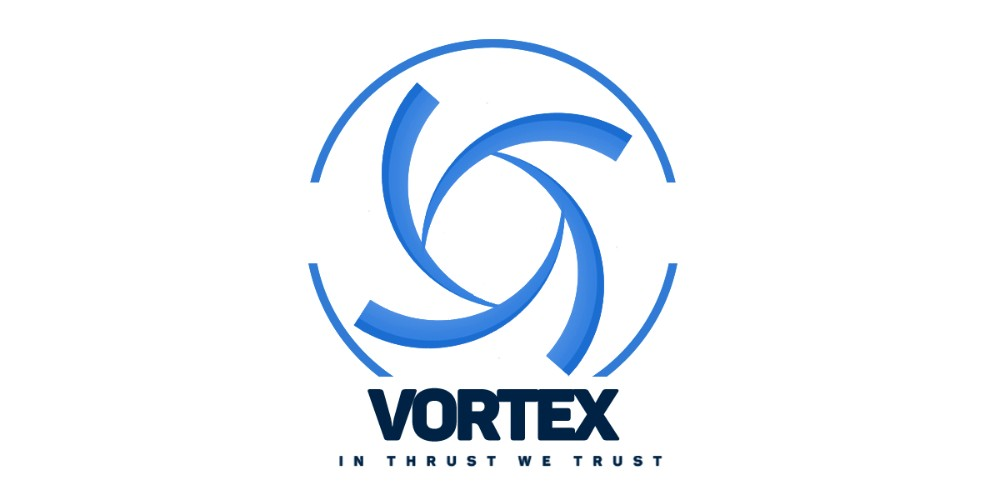

# VAUV

## VorteX AUV

---------

Th project aims for developing the most basic and common functionalities for underwater AUV and the software solution for the RoboSub competition 

Most of the platform will be based on the ROS architecture and the project will consist mainly of 4 parts.
* Electrical and Embedded 
* AUV basic feature
* RoboSub missions handling (This part will change every year based on the competition manual)
* Needed Software tools for developing and testing 

## Contributing

This Repo is under active development and we will be very happy to have your suppoy.

If you are interested to work in the topics in issues part or would like to work on other aspects, please contribute.  You can contact us directly (see below), submit an [issue](https://github.com/VorteX-co/VAUV/issues) or, better yet, submit a [pull request](https://github.com/VorteX-co/VAUV/pulls)!

We will do our best to document this on our [Contributors Wiki](https://github.com/VorteX-co/VAUV/wiki).

## Contacts

* Ibrahim Habib <ibrahim.habib@vortex-co.com>
* Mohamed Mehery <es-mohamed.abdelnasser1415@alexu.edu.eg>
