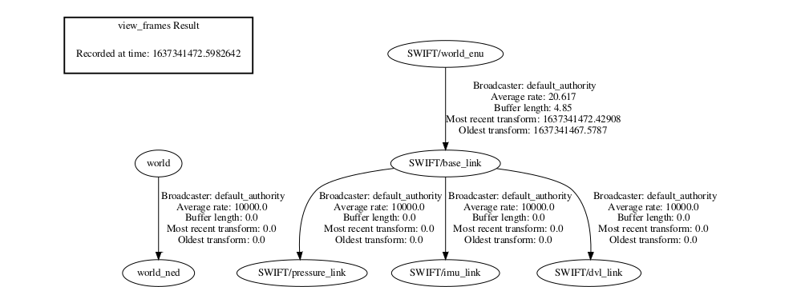

--------
Localization Package
------

--------
Table of contents
------

* [Prerequisites](#Prerequisites)
* [Dependencies](#Dependencies )
* [Nodes](#Nodes)
* [Usage](#Usage)

--------
Prerequisites
------

* ROS2 - Eloquent.

--------
Dependencies
------

* [geometry2](https://github.com/ros2/geometry2)

--------
Nodes
------

### sensors_transform

This nodes constructs a tf2 transformations tree for the localization purpose of swift AUV. Then it makes use of this tree to transform the measurments from the sensors frames to  a single frame `swift/base_link` by using the tf2 library, also publishes a single 'geometry_msgs/msg/Odometry.msg' ros message contains all the measurments that used in the update step within the ekf node.




--------
Usage
------

* launching the sensors_transform node:

```sh
  $ ros2 launch localization sensors_transform.launch.py"
```


