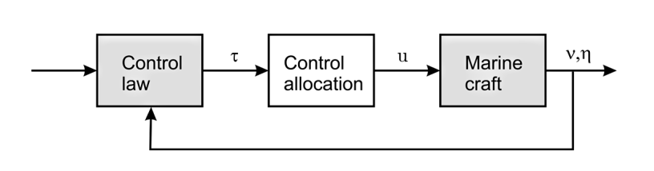
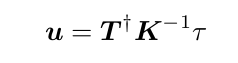
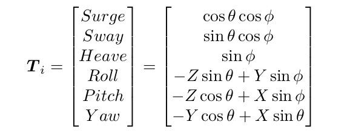

--------
Control Allocation
------

For marince craft with r actuators and n controlled DOF, it is necessary to distribute the generalized control forces τ n-D  to the actuators in terms of control inputs u r-D.



--------
Table of contents
------

* [Prerequisites](#Prerequisites)
* [Dependencies](#Dependencies )
* [Nodes](#Nodes)
* [Usage](#Usage)
* [Documentation](#Documentation)
* [References](#References)

--------
Prerequisites
------

* ROS2 - Eloquent.

--------
Dependencies
------

* Eigen3

--------
Nodes
------

### allocation_node

- Subscribed topics:
  - **`/swift/thruster_manager/input_stamped`** of type `geometry_msgs::msg::WrenchStamped`. The generalized control forces τ

- Published topics:
  - **`/swift/thruster_manager/pwm`** of type `std_msgs::msg::Int32MultiArray`. The commanded pwm vector to each thruster

--------
Usage
------

* Launching the node:

Specify the thrusters paramteres for you vehicle from the thuster.yaml file, then launch the node:

```sh
  $  ros2 launch control_allocation control_allocation.launch.py
```

--------
Documentation
------
The thrusters control vector `u` for r thrusters is computed as follows:



* `K`  is the thrust coefficient matrix (r,r).
* `T`  is the thruster configuration matrix  (n,r).
* `T†` is the Moore–Penrose inverse of matrix T (r,n).

The thruster configuration matrix T  is computed as follows: for r thrusters `T= [T1 .. Tr]`




 --------
References
------

[1] Handbook of Marine Craft Hydrodynamics and Motion Control, Thor I. Fossen, 2011
[2] Development and Commissioning of a DP system for ROV SF 30k, Viktor Berg, 2012

