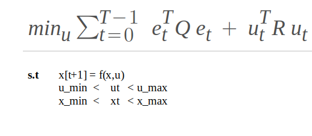
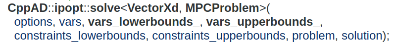
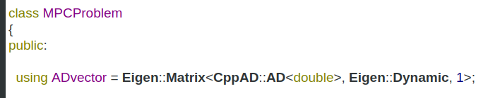
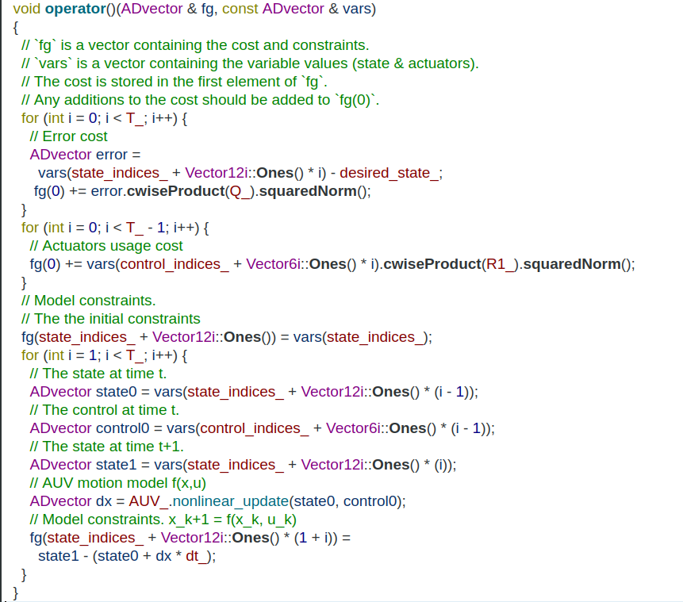

--------
Model Predicitive Control
------

Technical guide for the implementation of the Nonlinear Model Predicitive Tracking Control for 6DOF Motion control of AUV.

--------
Table of contents
------

* [Introduction](#Introduction)
* [Formulation](#Formulation)

--------
Introduction
------

Model predictive control, is an optimal control method where the control law is computed based on optimization process where a cost function `J` is minimized over a fixed horizon `T` subject to the discrete time system nonlinear dynamics `x[t + 1]  = f(xt, ut) * dt` where dt is the sampling time.

For solving this  nonlinear constrained optimization problem we are using [Ipopt](https://github.com/coin-or/Ipopt)

--------
Formulation
------

The function ipopt::solve solves nonlinear programming problems of the form

` vars `  the initial point where Ipopt starts the optimization process.
` vars_lowerbounds_ ` the lower limits for the argument in the optimization problem.
` vars_upperbounds_ ` the upper limits for the argument in the optimization problem.
` constraints_lowerbounds ` the lower limits for the constraints in the optimization problem.
` constraints_upperbounds` the upper limits for the constraints in the optimization problem.
` problem ` object that computes the optimization objective value/ cost and constraints given the optimization variables,  it should support the syntax `problem::ADvector` and `problem(fg, x)`.

### problem::ADvector

Using the CppAD::AD<double> as the base data type for performing the calculatins, this permits the automatic calculation of the jacobian of the cost and model constraints for the optimization.

The implementation of the syntax `problem(fg, x)`:

* Take a look at the Ipopt::[solve](https://coin-or.github.io/CppAD/doc/ipopt_solve.htm) documentation for further details and examples.

