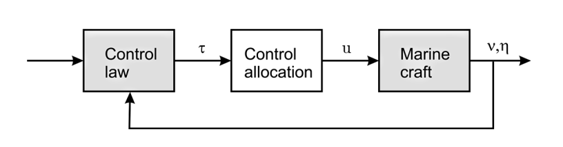
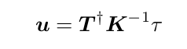
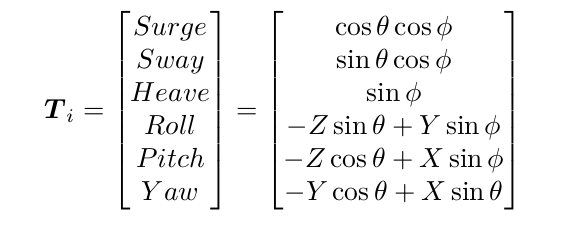

--------
Control Allocation
------

For marine craft in n DOF it is necessary to distribute the generalized control forces τ ∈ R ^ n to the actuators in terms of control inputs u ∈ R ^ r
For marince craft with r actuators and n  controlled DOF, it is necessary to distribute the generalized control forces τ n-D  to the actuators in terms of control inputs u r-D.

The thrusters control vector `u` for r thrusters is computed as follows:

* `K`  is the thrust coefficient matrix (r,r).
* `T`  is the thruster configuration matrix  (n,r).
* `T†` is the Moore–Penrose inverse of matrix T (r,n).

The thruster configuration matrix T  is computed as follows: for r thrusters `T= [T1 .. Tr]`

 --------
References
------

[1] Handbook of Marine Craft Hydrodynamics and Motion Control, Thor I. Fossen, 2011
[2] Development and Commissioning of a DP system for ROV SF 30k, Viktor Berg, 2012

