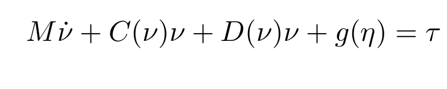

--------
AUV modelling
------

Technical guide for the implementation of the AUV motion model for control and simulation.

--------
Table of contents
------

* [Notations](#Notations)
* [Kinematics](#Kinematics)
* [Kinetics](#Kinetics)
* [Linearization](#Linearization)
* [References](#References)

--------
Notations
------

The motion of a marine craft in 6DOF is represented by the pose `η = [x y z φ θ ψ] ` and velocity `ν = [u v w p q r]` vectors according to the SNAME notation.

--------
Kinematics
------

The relationship between the body-fixed velocity `ν` and the inertial-coordinate velocity `η̇` is defined by the transformation matrix J(η),
` η̇ = J(η)ν `.

The C++  implementation of the kinematics is performed using the CppAD and Eigen libraries. CppAD is used for calculating the jacobian of any function at any time but we must use CppAD::AD<double> based data type during the operation, for thus purpose we use Eigen vector with base type CppAD::AD<double> ( Eigen::Matrix<CppAD::AD<double>, Eigen::Dynamic, 1> ).

--------
Kinetics
------

The relationship between any external/control forces `τ` and AUV motion variables `ν, ν̇ ` is governed by the following equation:

### Restoring forces g(η)

### Damping forces

The damping forces is computed as ` fd = D(ν) ν` where ` D(v) = D + Dn (ν)`,  D is a 6x6 Matrix contains the linear damping coefficients at the diagonals, Dn for nonlinear damping coefficients, and ν is the body velocity vector.

### The Coriolis–centripetal forces

`fc = C(v) v`, where C(v) is the Coriolis–centripetal matrix.

--------
Linearization
------

The linear equations of motion  `ẋ = Ax + Bu` are obtained by linearizing  `ẋ = f(x,u) about an equilibrium point [η0 ν0 τ0].

We use CppAD for calculating each Jacobian, for example linearizing the nonlinear restoring forces is performed as follows:

The complete linear-time-varying state-space model is expressed as follows:

--------
References
------

[1] Handbook of Marine Craft Hydrodynamics and Motion Control, Thor I. Fossen.

[2] H2 and H∞ Designs for Diving and Course Control of an Autonomous Underwater Vehicle in Presence of Waves, Lúcia Moreira, Carlos Guedes Soares, University of Lisbon, Article in IEEE Journal of Oceanic Engineering · May 2008.

