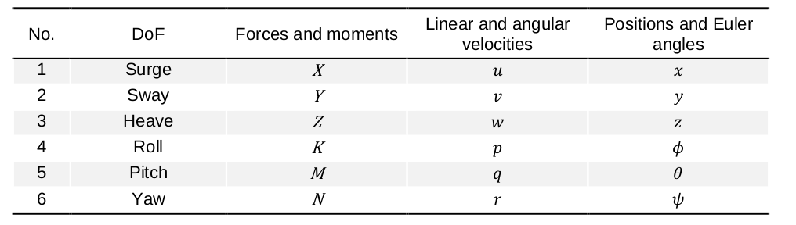
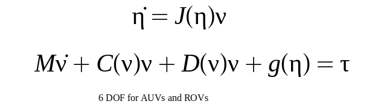
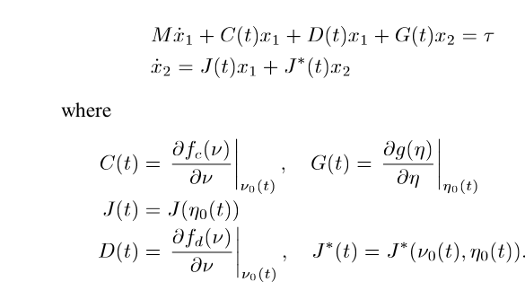
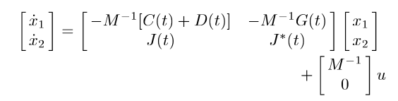
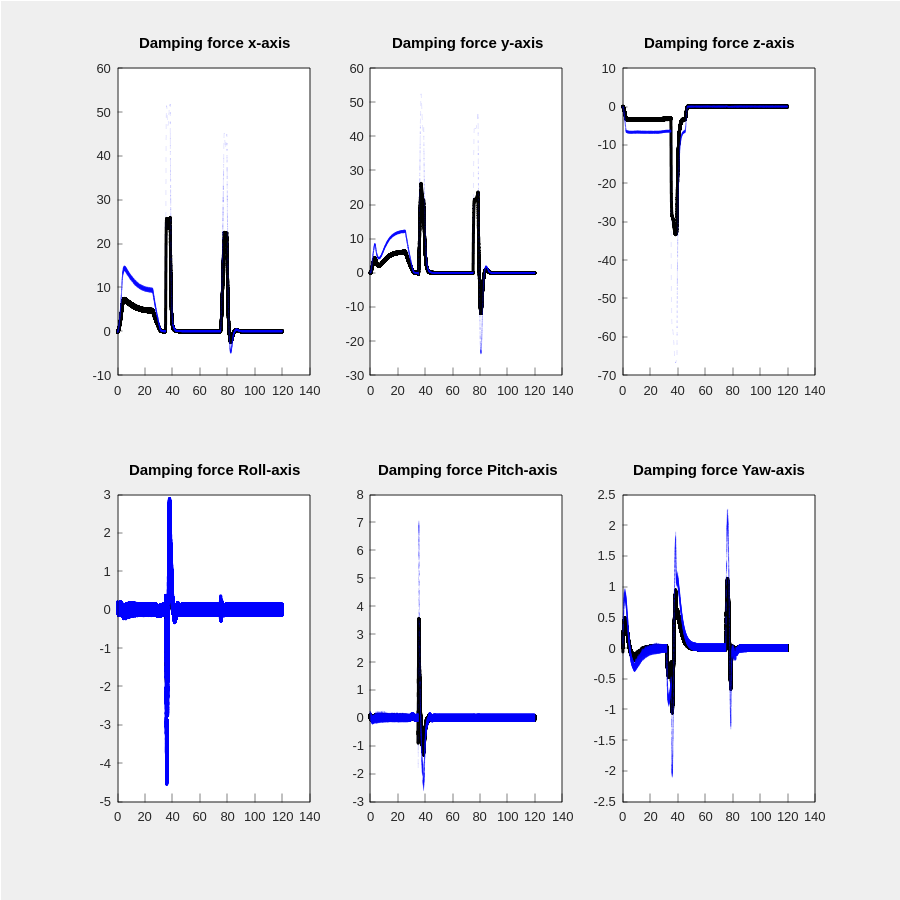
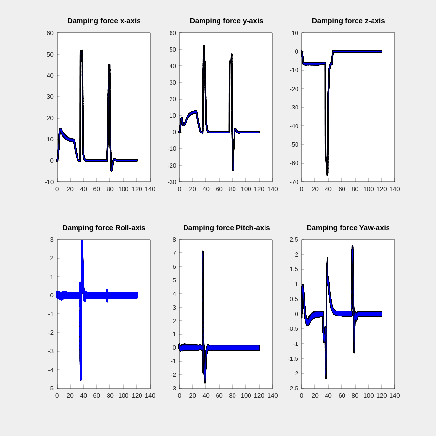
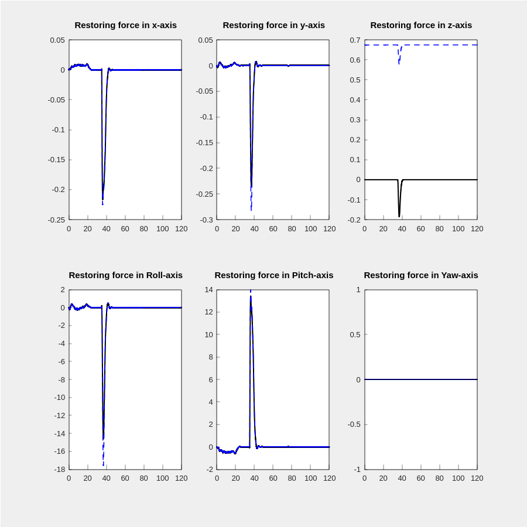
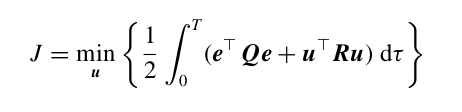
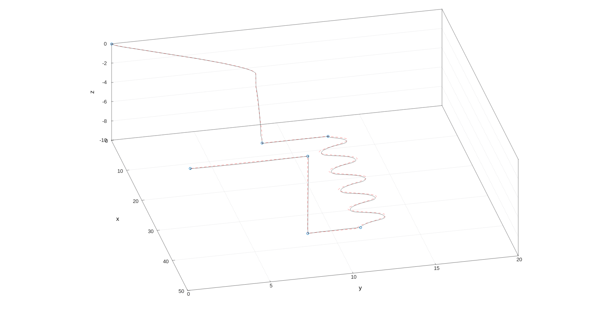

--------
Overview
------

Linear Quadratic Regulator for 6DOF AUV tracking control problem.

--------
Table of contents
------

* [Prerequisites](#Prerequisites)
* [Dependencies](#Dependencies )
* [Nodes](#Nodes)
* [Usage](#Usage)
* [Documentation](#Documentation)
* [Demonstration](#Demonstration)
* [References](#References)

--------
Prerequisites
------

* ROS2 - Eloquent.

--------
Dependencies
------

* Eigen3
* [lin_alg_tools](https://github.com/jerelbn/lin_alg_tools)
* [LAPACK](https://github.com/Reference-LAPACK/lapack)
* custom_ros_interfaces package

--------
Nodes
------

### controller_node

- Subscribed topics:
  - **`/local_planning/plan`** of type `std_msgs::msg::Float32MultiArray`. The real-time local plan consists of the  current state [pose η, velocity ν],
 desired_state and desired_acceleration.


- Published topics:
 - **`/swift/thruster_manager/input_stamped`** of type `geometry_msgs::msg::WrenchStamped`. The output control forces and moments.
 - **`/swift/thruster_manager/PWM`** of type `std_msgs::msg::Int32MultiArray`. Output control PWM values for each thruster.

--------
Usage
------

* Launching the node:

```sh
  $ ros2 launch trajectory_tracking_lqr lqr.launch.py
```

--------
Documentation
------

### Notations


The motion of a marine craft in 6DOF is represented by the pose `η = [x y z φ θ ψ] ` and velocity `ν = [u v w p q r]` vectors according to the SNAME notation




### AUV state space model


For the autonomous underwater vehicle system the the 6 DOF nonlinear equations of motion can be written as:



Constructing the linear time varying state space `ẋ = A(t)x + B(t)u` model is obtained by linearization of the nonlinear equations about an equilibrium point `[η0,ν0]`.







* `Plant` Class contains a methods for kinematics and kinetics calculation based on CppAD for automatic differentation. 


### Testing the linearization


Choosing the equilibrium state for linearization is the key for good performance. in the following figure the nonlinear damping forces are plotted in dashed-blue and the linear damping forces are plotted in solid-black. The equilibrium velocity is ` nu_eq = Zeros(6x1)`





For equilibrium velocity `nu_eq = 0.5 * nu` the linearization is better.





The nonlinear restoring forces and moments and the respective linearization.





### LQR Design for Trajectory Tracking


The control objective is to design a LQ optimal tracking controller using a time-varying reference trajectory `xd = [ηd νd]`. For this purpose a quadratic cost function is construced to minimize the tracking error `e := x - xd` subjected to linear system constraints `ẋ = A(t)X + B(t)U`.





* `LQR` Class contains a method for solving this optimization problem using a tool from [lin_alg_tools](https://github.com/jerelbn/lin_alg_tools)


--------
Demonstration
------

Simulating the LQR to track a desired 3D trajectory colored in dashed-red in the figure below, which is generated by the local planner between a global waypoints represented by the blue spheres. 



--------
References
------

[1] Handbook of Marine Craft Hydrodynamics and Motion Control, Thor I. Fossen.

[2] H2 and H∞ Designs for Diving and Course Control of an Autonomous Underwater Vehicle in Presence of Waves, Lúcia Moreira, Carlos Guedes Soares, University of Lisbon, Article in IEEE Journal of Oceanic Engineering · May 2008.

