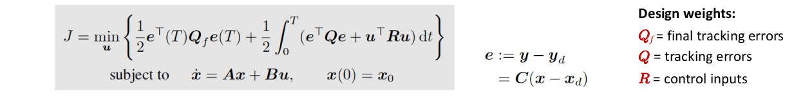

--------
Overview
------

Linear Quadratic Regulator for 6DOF AUV tracking control problem.

--------
Table of contents
------

* [Prerequisites](#Prerequisites)
* [Dependencies](#Dependencies )
* [Nodes](#Nodes)
* [Usage](#Usage)
* [Documentation](#Documentation)
* [References](#References)

--------
Prerequisites
------

* ROS2 - Eloquent.

--------
Dependencies
------

* [ruckig](https://github.com/pantor/ruckig)
* Eigen3
* [lin_alg_tools](https://github.com/jerelbn/lin_alg_tools)
* [LAPACK](https://github.com/Reference-LAPACK/lapack)
* custom_ros_interfaces package

--------
Nodes
------

### controller_node

- Subscribed topics:
  - **`/odometry/filtered`** of type `nav_msgs/msg/Odometry`. The current state of the vehicle [pose η, velocity ν].
  - **`/LQR/cmd_waypoint`** of type `geometry_msgs/msg/Point`. A desired 3D waypoint.
   - **`/LQR/cmd_attitude`** of type `geometry_msgs/msg/Point`. A desired 3D attitude [rpy].
  - **`/LQR/cmd_roll`** of type `std_msgs/msg/Float32`. A desired roll-angle.
  - **`/LQR/cmd_pitch`** of type `std_msgs/msg/Float32`. A desired pitch-angle.
  - **`/LQR/cmd_yaw`** of type `std_msgs/msg/Float32`. A desired yaw-angle.
  - **`/LQR/cmd_hold`** of type `std_msgs/msg/Float32`. A station keeping command.

- Published topics:
  - **`/swift/thruster_manager/input_stamped`** of type `geometry_msgs::msg::WrenchStamped`. The output control forces and moments.

- Service Clients:
 - **`control_pwm`** of type `custom_ros_interfaces/srv/PWM`. Output control PWM  to the autopilot Pixhawk4.

--------
Usage
------

* Launching the node:

```sh
  $ ros2 launch trajectory_tracking_lqr lqr.launch.py
```

* Sending a reference waypoint in ENU inertial frame:

```sh
  $ ros2 topic pub --once /LQR/cmd_waypoint geometry_msgs/msg/Point "{x: 48.5 , y: 35.5, z: -40.0}"
```

* Sending a reference roll-angle in ENU inertial frame:

```sh
  $ ros2 topic pub --once /LQR/cmd_roll std_msgs/msg/Float32 "{data: 0.5}"
```

* Sending a reference pitch-angle in ENU inertial frame:

```sh
  $ ros2 topic pub --once /LQR/cmd_pitch std_msgs/msg/Float32 "{data: 0.7071}"
```

* Sending a reference yaw-angle in ENU inertial frame:

```sh
  $ ros2 topic pub --once /LQR/cmd_yaw std_msgs/msg/Float32 "{data: 0.52}"
```

--------
Documentation
------

### Notations

The motion of a marine craft in 6DOF is represented by the pose `η = [x y z φ θ ψ] ` and velocity `ν = [u v w p q r]` vectors according to the SNAME notation


### AUV state space model

For the autonomous underwater vehicle system the the 6 DOF nonlinear equations of motion can be written as:


Constructing the linear parameter varying state space `ẋ = A(t)x + B(t)u`  where  the state vector x is column vector [η ν] and `u` is the control input to the system. The kinematics equation from the previous nonlinear equations of motion is already in this format but the kinetics equations requires a little manipulation


The system matrix `A` and control matrix `B` can be written as


### LQR Design for Trajectory Tracking

The LQR computes a control law for a given system linear system such that a certain optimality criterion is achieved. This is usually a quadratic cost function that depends on the state and control variables. For the trajectory tracking problem the LQR is designed to track a time-varying reference trajectory `xd =[ηd νd]` for this purpose we augment the state space model to the form `ė = Ae + Bu` where  `e = x-xd` is the tracking error. The optimal feedback control law is computed as `u = -Ke` where K is the optimal control gain founded by minimizing the quadratic performance index



### Impelementation

* `Trajectory` Class wrappes the methods provided by [ruckig](https://github.com/pantor/ruckig) library for the generation of smooth time-varying trajectory.
* `LOS` Class impelements the line-of-sight guidance for automatic steering of the AUV by calculating an appropriate reference yaw-angle `ψd`
* `LQR` Class contains a method for solving the LQR problem and some methods for kinematics and kinetics calculation.
* `Controller` Class wrappes the ROS interfacing methods.


 --------
References
------

[1] Handbook of Marine Craft Hydrodynamics and Motion Control, Thor I. Fossen.

