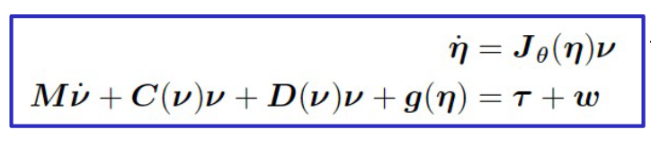
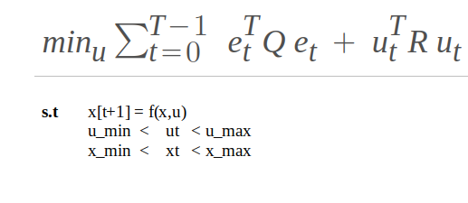
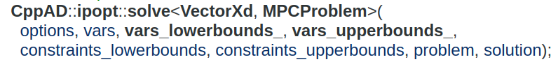
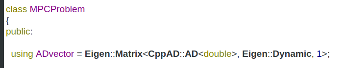
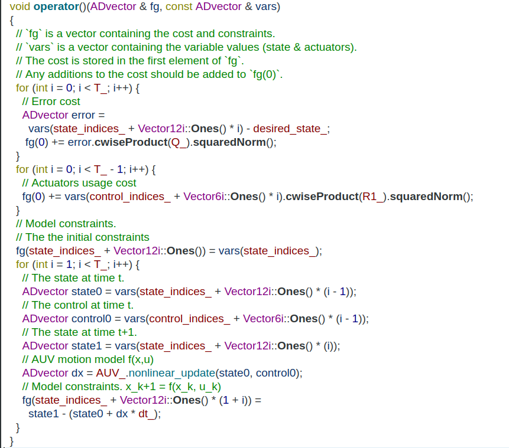
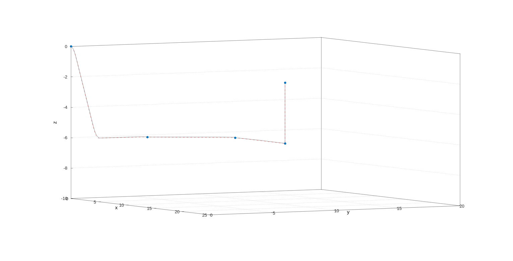

--------
Overview
------

Model predictive controller for 6DOF AUV tracking control problem.

--------
Table of contents
------

* [Prerequisites](#Prerequisites)
* [Dependencies](#Dependencies )
* [Nodes](#Nodes)
* [Usage](#Usage)
* [Documentation](#Documentation)
* [Demonstration](#Demonstration)
* [References](#References)

--------
Prerequisites
------

* ROS2 - Eloquent.

--------
Dependencies
------

* Eigen3
* ipopt
* custom_ros_interfaces package

--------
Nodes
------

### controller_node

- Subscribed topics:
  - **`/local_planning/plan`** of type `std_msgs::msg::Float32MultiArray`. The real-time local plan consists of the  current state [pose η, velocity ν],
 desired_state and desired_acceleration.


- Published topics:
 - **`/swift/thruster_manager/input_stamped`** of type `geometry_msgs::msg::WrenchStamped`. The output control forces and moments.
 - **`/swift/thruster_manager/PWM`** of type `std_msgs::msg::Int32MultiArray`. Output control PWM values for each thruster.

--------
Usage
------

* Launching the node:

```sh
  $ ros2 launch trajectory_tracking_mpc mpc.launch.py
```

--------
Documentation
------

### Notations


The motion of a marine craft in 6DOF is represented by the pose `η = [x y z φ θ ψ] ` and velocity `ν = [u v w p q r]` vectors according to the SNAME notation


### AUV model


Model preditive controller depends on an model of the plant dynamics, the autonomous underwater vehicle nonlinear motion model in 6 DOF can be written as:




* `Plant` Class contains a methods for kinematics and kinetics calculation based on CppAD for automatic differentation. 


### MPC Design for Trajectory Tracking


Model predictive control, is an optimal control method where the control law is computed based on optimization process where a cost function `J` is minimized over a fixed horizon `T` subject to the discrete time system nonlinear dynamics `x[t + 1]  = f(xt, ut) * dt` where dt is the sampling time.





For solving this  nonlinear constrained optimization problem we are using [Ipopt](https://github.com/coin-or/Ipopt), The function ipopt::solve solves nonlinear programming problems of the form





` vars ` the initial point where Ipopt starts the optimization process.
` vars_lowerbounds_ ` the lower limits for the argument in the optimization problem.
` vars_upperbounds_ ` the upper limits for the argument in the optimization problem.
` constraints_lowerbounds ` the lower limits for the constraints in the optimization problem.
` constraints_upperbounds` the upper limits for the constraints in the optimization problem.
` problem ` object that computes the optimization objective value/ cost and constraints given the optimization variables,  it should support the syntax `problem::ADvector` and `problem(fg, x)`.


* problem::ADvector

Using the CppAD::AD<double> as the base data type for performing the calculation, this permits the automatic calculation of the jacobian of the cost and model constraints for the optimization.





The implementation of the syntax `problem(fg, x)`:





* Reference Ipopt::[solve](https://coin-or.github.io/CppAD/doc/ipopt_solve.htm).


--------
Demonstration
------

Simulating the MPC to track a desired 3D trajectory colored in dashed-red in the figure below, which is generated by the local planner between a global waypoints represented by the blue spheres. 



--------
References
------

[1] Handbook of Marine Craft Hydrodynamics and Motion Control, Thor I. Fossen.


