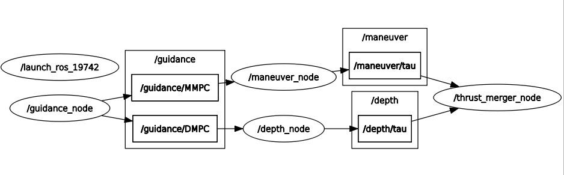
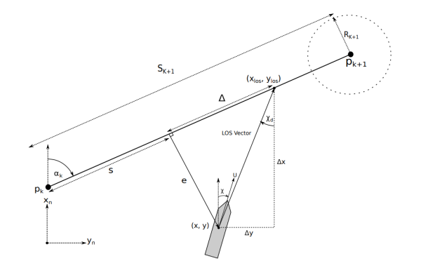
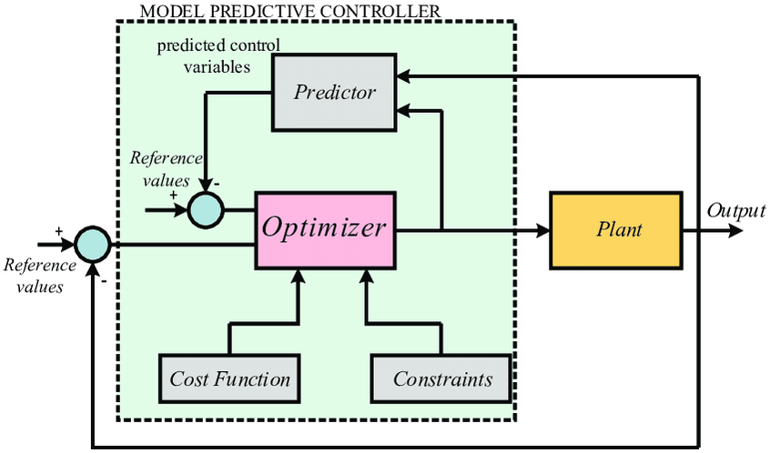
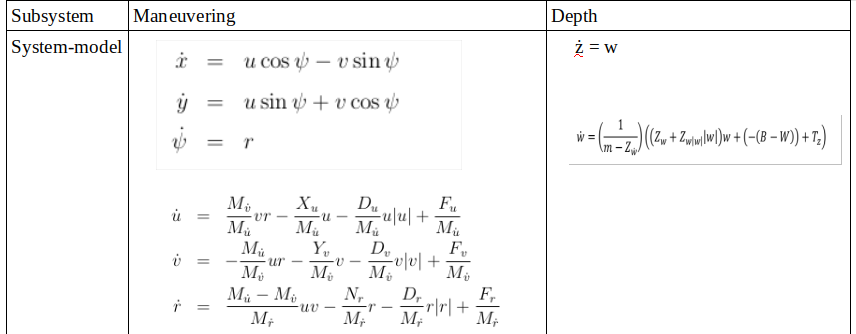
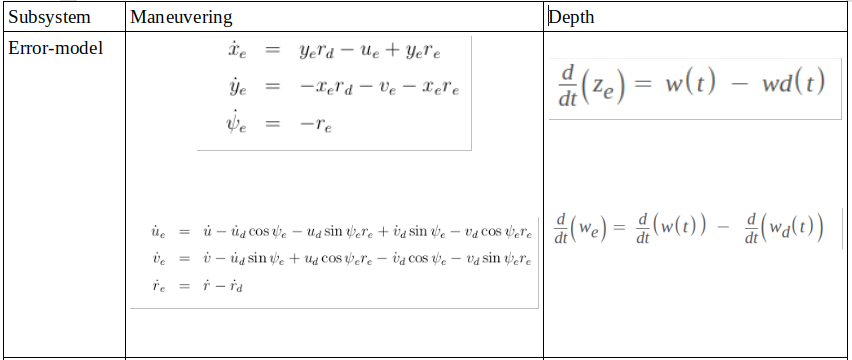
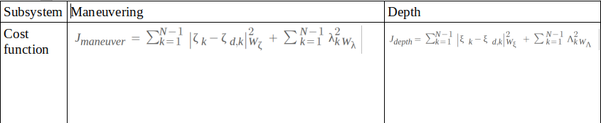

trajectory_tracking_mpc
======

Distributed nonlinear model predictive control software for the trajectory tracking of an autonomous underwater vehicle.

--------
Overview
------

A Computationally efficient implementation of NMPC for AUV to track a time-varying trajectory, by exploiting the fact that at low-speed applications the six DOF equations of motion of an underwater vehicle can be divided into two slightly coupled subsystems for diving and maneuvering, therefore the subproblems are solved in parallel which significantly reduces the computation time of the large NMPC problem.

--------
Table of contents
------

* [Prerequisites](#Prerequisites)
* [Dependencies](#Dependencies )
* [Nodes](#Nodes)
* [Usage](#Usage)
* [Implementation](#Implementation)
* [References](#References)

--------
Prerequisites
------

* ROS2 - Eloquent.

--------
Dependencies
------

* CppAD
* Ipopt 3.12.x
* Eigen3
* Ceres

--------
Nodes
------



### guidance_node

- Published topics:
  - **`/guidance/MMPC`** of type `custom_ros_interfaces/msg/MMPC`. Custom ros2 msg contains the required states by the maneuvering model predicive controller, namely `AUV state`, `Reference state` and `Error state`.
   - **`/guidance/DMPC`** of type `custom_ros_interfaces/msg/DMPC`. Custom ros2 msg contains the required states by the depth model predicive controller, namely `AUV state`, `Reference state` and `Error state`

- Subscribed topics:
  - **`/rexrov/pose_gt`** of type `nav_msgs/msg/Odometry`. This is the current state of the vehicle. The odometry msg includes pose and twist information.
  - **`/guidance/point`** of type `geometry_msgs/msg/Point`. This is a desired 3D waypoint..

- Parameteres:

| Parameter           |  Description  |
|------------------|--------------------------------------------------------------------------------------------------------------------------------|
| max_xy         | Maximum length of a square horizontal plane. |
| max_z     | Maximum depth of the operating environment. |
| max_align_inclination        | Set heading towards destination when path inclination is less than this value |
| max_x_vel         | Maximum linear velocity in x.|
| max_y_vel         | Maximum linear velocity in y.|
| max_z_vel         | Maximum linear velocity in z.|
| max_x_acc         | Maximum linear acceleration in x.|
| max_y_acc        | Maximum linear acceleration in y.|
| max_z_acc         | Maximum linear acceleration in z.|
| max_rot_vel         | Maximum yaw angular velocity.|
| max_rot_acc           | Maximum yaw angular acceleration.|
| delta                         | Lookahead distance value for the LOS steering

### maneuver_node

- Published topics:
  - **`/maneuver/tau`** of type `geometry_msgs::msg::WrenchStamped`. The output control forces, namely `Fx` , `Fy` and `Mz`.

- Subscribed topics:
  - **`/guidance/MMPC`** of type `custom_ros_interfaces::msg::MMPC`. Custom ros2 msg contains the required information for the maneuver MPC to work, namely the `AUV-state`, the `Reference-state` and the `Error-state`.

- Parameteres:

| Parameter           |  Description  |
|------------------|--------------------------------------------------------------------------------------------------------------------------------|
| N        | Prediction horizon. |
| dt     | Sampling time. |
| w_xe         | Cost function weight on the `x` tracking error. |
| w_ye         | Cost function weight on the `y` tracking error. |
| w_psie         | Cost function weight on the `yaw` tracking error. |
| w_ue         | Cost function weight on the `u` tracking error. |
| w_ve         | Cost function weight on the `v` tracking error. |
| w_re         | Cost function weight on the `r` tracking error. |
| w_Fx           | Cost function weight on using the surge actuation. |
| w_Fy           | Cost function weight on using the sway actuation. |
| w_Mz           | Cost function weight on using the yaw actuation. |
| w_Fx_dot         | Cost function weight on the rate of using the surge actuation. |
| w_Fy_dot           | Cost function weight on the rate of using the sway actuation. |
| w_Mz_dot           | Cost function weight on the rate of using the yaw actuation. |
| Mx       | Total surge mass, rigid body mass + added mass. |
| My       | Total sway mass, rigid body mass + added mass. |
| Mpsi       | Total yaw inertia,rigid body inertia Izz + added inertia. |
| LDx         | Linear damping in surge. |
| LDy         | Linear damping in sway. |
| LDpsi         | Linear damping in yaw. |
| QDx         | Quadratic damping in surge. |
| QDy         | Quadratic damping in sway. |
| QDpsi         | Quadratic damping in yaw. |

### depth_node

- Published topics:
  - **`/depth/tau`** of type `geometry_msgs::msg::WrenchStamped`. The output control forces, namely `Fz`.

- Subscribed topics:
  - **`/guidance/DMPC`** of type `custom_ros_interfaces::msg::DMPC`. Custom ros2 msg contains the required information for the depth MPC to work, namely the `AUV-state`, the `Reference-state` and the `Error-state`.

--------
Parameters
------
| Parameter           |  Description  |
|------------------|--------------------------------------------------------------------------------------------------------------------------------|
| N        | Prediction horizon. |
| dt     | Sampling time. |
| w_ze         | Cost function weight on the heave `z` tracking error. |
| w_psie         | Cost function weight on the `pitch` tracking error. |
| w_we         | Cost function weight on the heave speed `w` tracking error. |
| w_Fz           | Cost function weight on using the heave actuation. |
| w_My           | Cost function weight on using the pitch actuation. |
| w_Fz_dot         | Cost function weight on the rate of using the heave actuation. |
| w_My_dot           | Cost function weight on the rate of using the pitch actuation. |
| Mz       | Total heave mass, rigid body mass + added mass. |
| Mtheta       | Total pitch inertia,rigid body inertia Iyy + added inertia. |
| LDz         | Linear damping in heave. |
| LDtheta         | Linear damping in pitch. |
| QDz         | Quadratic damping in heave. |
| QDtheta         | Quadratic damping in pitch. |


### thrust_merger_node

- Published topics:
  - **`/rexrov/thruster_manager/input_stamped`** of type `geometry_msgs::msg::WrenchStamped`. The combined output control forces, namely `Fx` , `Fy` , `Mz` and  `Fz`.

- Subscribed topics:
  - **`/maneuver/tau`** of type `geometry_msgs::msg::WrenchStamped`. The control forces from the maneuvering sub-system.
    - **`/depth/tau`** of type `geometry_msgs::msg::WrenchStamped`.  The control force from the diving sub-system.

--------
Usage
------

* Launching the nodes:

```sh
  $ ros2 launch trajectory_tracking_mpc mpc.launch.py
```

* Sending a reference waypoint:

```sh
  $ ros2 topic pub --once /guidance/waypoint geometry_msgs/msg/Point "{x: 48.5 , y: 25.5, z: -4.0}"
```

--------
Implementation
------

### Trajectory Generation

The objective in trajectory tracking control is to force the system output `η(t) = [x(t), y(t), z(t)]` and `ν(t) = [u(t), v(t), w(t)]`  to track a desired output `ηd(t) = [xd(t), yd(t), zd(t)]` and `νd(t) = [ud(t), vd(t), wd(t)]`. The choice of trajectory generator should reflect the dynamics of the vehicle such that a feasible trajectory is constructed. For instance, it is important to take into account physical speed and acceleration limitations of the vehicle. For this purpose we used a Quintic polynomial (5th order) trajectory generator for smooth and  jerk-minimum motion. The software for this system is based on [auv_gnc](https://github.com/tsender/auv_gnc) library, where we feed it with the start state [position, velocity and acceleration] and the end state as well as some physical constraints, then we get a variable with a data-type `auv_guidance::BasicTrajectory` which can be evaluted at any time-stamp to get the reference state `basicTrajectory->computeState(t)` which helds the reference position and velocity in 3D  and `basicTrajectory->computeAccel(t)` which helds the reference acceleration.

### Steering Law

The LOS guidance method is used  for generating heading reference. In LOS guidance, the vehicle follows a LOS vector pointing from a reference point to a point `(x_los , y_los )` located at distance `∆`  ahead of the projection point of the vehicle along the path. Based on geometric calculations the reference heading  is `ψd = χd`.





### Distributed MPC.

The maneuvering subsystem includes the states `ζ = [x, y, ψ, u, v, r]` with control signal `λ = [Fu , Fv , Fr ]`, while the depth subsystem includes the states `ξ = [z, φ, θ, w, p, q]` with control signal `Λ = [Fw]`, therefore the total control signal is `τ = [Fu , Fv , Fw , 0, 0, Fr ]`. The success of this distribution is based on two assumptions must be true: (1) Low-speed motion, (2) The roll `φ`  and pitch `θ`  angles are ≈ 0, i.e., the vehicle is stable by default in these angles.

MPC uses a model of the controlled system to make predictions about future system outputs. It solves an optimization problem at each time step given a defined cost-function to find the optimal control action that drives the predicted system output to the desired reference as close as possible. That's why it's also called a a receding horizon control.











  
 --------
References
------

[1] Handbook of Marine Craft Hydrodynamics and Motion Control, Thor I. Fossen.

[2] C. Shen, Y. Shi, and B. Buckham. Distributed implementation for nonlinear model predictive tracking control of an AUV. IEEE/ASME Transactions on Mechatronics, under review, 2017.

[3] C. Shen, Y. Shi, and B. Buckham. Integrated path planning and tracking control of an AUV: A unified receding horizon optimization approach. IEEE/ASME Transactions on Mechatronics, 22(3):1163 – 1173, 2017.


