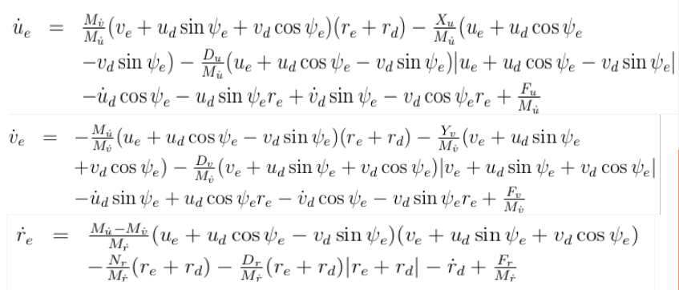

maneuver_mpc
======

Nonlinear model predictive control software for the trajectory tracking application of an autonomous underwater vehicle in the horizontal plane.
--------
Overview
------

Due to the computational burden of the NMPC for The six degree of freedom motion control, the problem is distributed into two slightly coupled subsystems namely, maneuver system and depth system. This is package is an  implementation of the maneuver part of the distributed MPC.

--------
Table of contents
------
* [Prerequisites](#Prerequisites)
* [Dependencies](#Dependencies )
* [Implementation](#Implementation)
* [Parameters](#Parameters)
* [Usage](#Usage)
* [Interface](#Interface)
* [References](#References)
--------
Prerequisites
------
* ROS2 - Eloquent.

--------
Dependencies
------

* CppAD
* Ipopt 3.12.x
* Eigen3


--------
Implementation
------
The MPC method is an iterative optimization process where the cost function `J` is minimized over a fixed horizon `N` subjected to the discrete time system dynamics `model`. Defining the cost function and the system model is a trade-off between accuracy and computational complexity, our choice of both is described below:
 - **`Model`**:
 For applications like the autonomous ground vehicles only the kinematics model is sufficient for predicting the motion, but this is not the case for the underwater vehicles due to the highly nonlinear coupled dynamics, thus we consider both the kinematics and dynamics model.


In order to regulate a system to an equilibrium state the dynamics model needs to be augmented by the output error or tracking error. Our MPC is serves as kinematics as well as dynamics controller, hence we added both positional tracking error and velocity tracking error.



- **`Cost`**:
The cost function consists of three parts, tracking error, actuators usage and  the rate of using the actuators:


--------
Parameters
------
| Parameter           |  Description  |
|------------------|--------------------------------------------------------------------------------------------------------------------------------|
| N        | Prediction horizon. |
| dt     | Sampling time. |
| w_xe         | Cost function weight on the `x` tracking error. |
| w_ye         | Cost function weight on the `y` tracking error. |
| w_psie         | Cost function weight on the `yaw` tracking error. |
| w_ue         | Cost function weight on the `u` tracking error. |
| w_ve         | Cost function weight on the `v` tracking error. |
| w_re         | Cost function weight on the `r` tracking error. |
| w_Fx           | Cost function weight on using the surge actuation. |
| w_Fy           | Cost function weight on using the sway actuation. |
| w_Mz           | Cost function weight on using the yaw actuation. |
| w_Fx_dot         | Cost function weight on the rate of using the surge actuation. |
| w_Fy_dot           | Cost function weight on the rate of using the sway actuation. |
| w_Mz_dot           | Cost function weight on the rate of using the yaw actuation. |
| Mx       | Total surge mass, rigid body mass + added mass. |
| My       | Total sway mass, rigid body mass + added mass. |
| Mpsi       | Total yaw inertia,rigid body inertia Izz + added inertia. |
| LDx         | Linear damping in surge. |
| LDy         | Linear damping in sway. |
| LDpsi         | Linear damping in yaw. |
| QDx         | Quadratic damping in surge. |
| QDy         | Quadratic damping in sway. |
| QDpsi         | Quadratic damping in yaw. |

--------
Usage
------

* Launching the maneuver_mpc node:
  
```sh
  $ ros2 launch maneuver_mpc maneuver.launch.py
```

--------
Interface
------

The maneuver_mpc node publishs and subscribes to the following topics:

- Published topics:
  - **`/rexrov/thruster_manager/input_stamped`** of type `geometry_msgs::msg::WrenchStamped`. The output control forces, namely `Fx` , `Fy` and `Mz`.


- Subscribed topics:
  - **`/guidance/MMPC`** of type `custom_ros_interfaces::msg::MMPC`. Custom ros2 msg contains the required information for the maneuver MPC to work, namely the `AUV-state`, the `Reference-state` and the `Error-state`.
  

  
 --------
References
------

[1] C. Shen, Y. Shi, and B. Buckham. Distributed implementation for nonlinear model predictive tracking control of an AUV. IEEE/ASME Transactions on Mechatronics, under review, 2017.
[2] C. Shen, Y. Shi, and B. Buckham. Integrated path planning and tracking control of an AUV: A unified receding horizon optimization approach. IEEE/ASME Transactions on Mechatronics, 22(3):1163 – 1173, 2017.


