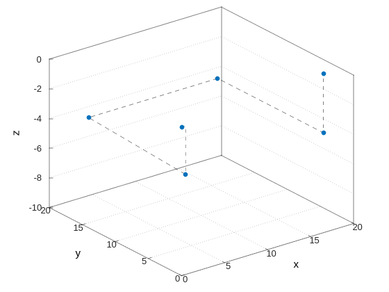
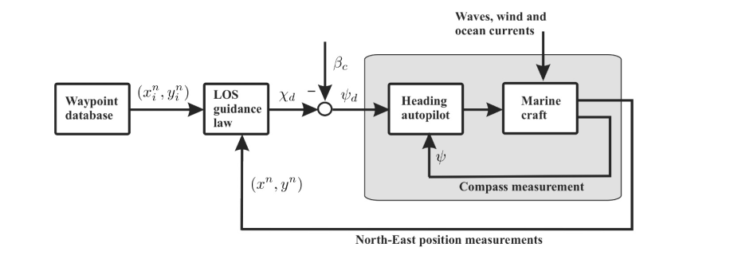
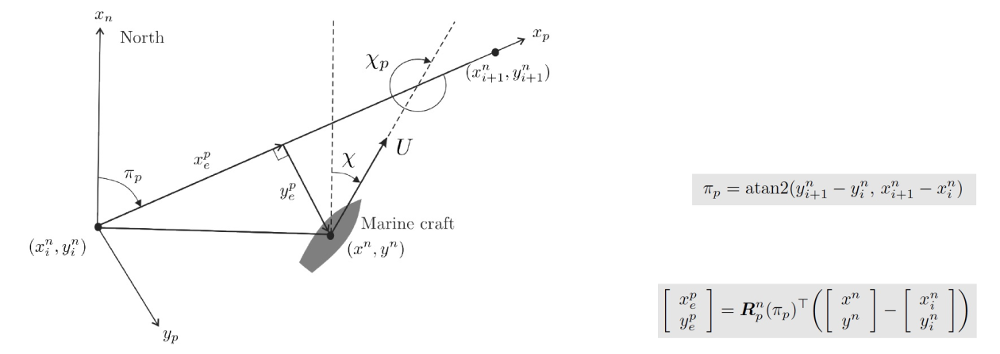

# Motion Planning Package

## Description

This package deals with finding an optimal or sub-optimal route between an origin point and a termination point in marine environments. The underwater environment is still considered as a great challenge for the path planning of autonomous underwater vehicles (AUVs) because of its dynamic nature, So this package aims to make the AUV more adaptable to these challenges.

It consists of two modules ( global planner, local planner)


* The Global Planner: Determines a set of waypoints on a map for the AUV to go through in order to finish the mission goal successfully.

* The Local Planner: generate a feasible path between the waypoints given from the global planner taking the dynamics into consideration while also trying to avoid obstacles.


### License

The source code is released under a [GNU GENERAL PUBLIC LICENSE](https://github.com/VorteX-co/VAUV/blob/master/LICENSE)

**Author: vortex-co<br />
Affiliation: [VorteX-Co](https://vortex-co.com/home)<br />
Maintainer: vortex-co, info@vortex-co.com**

The motion planning  module package has been tested under [ROS2](https://index.ros.org/doc/ros2/) eloquent on Ubuntu 18.04 


## Table of contents

* [Prerequisites](#Prerequisites)
* [Dependencies](#Dependencies )
* [Nodes](#Nodes)
* [Usage](#Usage)
* [Documentation](#Documentation)


--------
Prerequisites
------

* ROS2 - Eloquent.

--------
Dependencies
------

* Eigen3
* [ruckig](https://github.com/pantor/ruckig)


--------
Nodes
------

### local_planner_node

- Subscribed topics:

  - **`/odometry/filtered`** of type `nav_msgs/msg/Odometry`. The current state of the vehicle [pose η, velocity ν].
  - **`/local_planning/cmd_waypoint`** of type `geometry_msgs/msg/Point`. A desired 3D waypoint.
  - **`/local_planning/cmd_attitude`** of type `geometry_msgs/msg/Point`. A desired 3D attitude [rpy].
  - **`/local_planning/cmd_roll`** of type `std_msgs/msg/Float32`. A desired roll-angle.
  - **`/local_planning/cmd_pitch`** of type `std_msgs/msg/Float32`. A desired pitch-angle.
  - **`/local_planning/cmd_yaw`** of type `std_msgs/msg/Float32`. A desired yaw-angle.


- Published topics:
 - **`/local_planning/plan`** of type `std_msgs::msg::Float32MultiArray`. The real-time local plan consists of the  current state [pose η, velocity ν],
 desired_state and desired_acceleration.


--------
Usage
------


### local_planner_node


* Launching the node:

```sh
  $ ros2 launch motion_planning local_planning.launch.py
```

* Sending a reference waypoint in ENU inertial frame:

```sh
  $ ros2 topic pub --once /local_planning/cmd_waypoint geometry_msgs/msg/Point "{x: 48.5 , y: 35.5, z: -40.0}"
```

* Sending a reference roll-angle in ENU inertial frame:

```sh
  $ ros2 topic pub --once /local_planning/cmd_roll std_msgs/msg/Float32 "{data: 0.5}"
```

* Sending a reference pitch-angle in ENU inertial frame:

```sh
  $ ros2 topic pub --once /local_planning/cmd_pitch std_msgs/msg/Float32 "{data: 0.7071}"
```

* Sending a reference yaw-angle in ENU inertial frame:

```sh
  $ ros2 topic pub --once /local_planning/cmd_yaw std_msgs/msg/Float32 "{data: 0.52}"
```


--------
Documentation
------


### local planning

For state-to-state motion generation we are using [ruckig](https://github.com/pantor/ruckig) which generates a time-optimal trajectory given start state to an end state. The following figure shows the generated trajectory between the global waypoints shown in blue filled spheres.





For steering the vehicle to follow a linear path connected between two waypoints we are using the Line-of-sight steering law.




The LOS is a 3-point guidance scheme computes the desired course angle χd such that the velocity vector is along the  desired path  and also ensures that the cross-track-error converges to 0 (ye -->0). 



