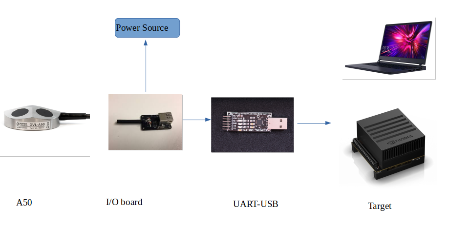
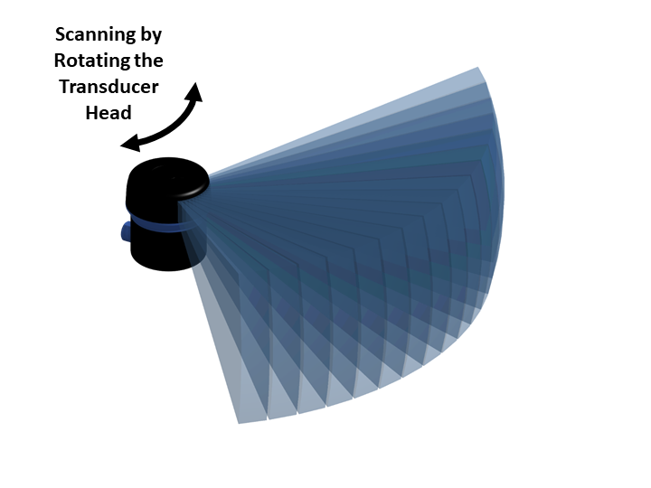

## Sensors interfacing package
## Table of contents
* [Overview](#Overview)
* [Prerequisites](#Prerequisites)
* [Dependencies](#Dependencies )
* [DVL Sensor]
  * [A50 Description](#A50-Description)
  * [A50 Usage](#A50-Usage)
  * [A50 Technical Details](#A50-Technical-Details)
* [Sonar Sensor]
  * [Ping360 Description](#Ping360-Description)
  * [Ping360 Usage](#Ping-Usage)
  * [Technical Details](#Technical-Details)

## Overview

sensors is a ros2 package encapsulates c++ nodes required for interfacing with the onboard-sensors


## Prerequisites
* Linux distributions Bionic (Ubuntu 18.04)
* C++ 14 compiler or newer.
* ROS2 - Eloquent. 
* cloned VorteX-co/VAUV repo
* built the packages  ~/vortex_ws$ colcon build packages-select custom_ros_interfaces sensors

## Dependencies 
* ros_custom_interfaces package 

## A50-Description
* ROS2 package for serial-interfacing with waterlinked A50 DVL. There is also an associated custom-ros2-message for DVL measurement data.
* 

## A50-Usage
1- Source the vortex_ws workspace
```
$ cd ~/vortex_ws
$ . /install/setup.bach
```
2- run the dvl node 'the default USB port number is 1,in future this would be an argument when executing the dvl node'
```
$ ros2 run sensors dvl
```
## A50-Technical-Details
dvl is a c++ publisher node, that publishes a DVL message over a topic called a50.
The frequency at which the dvl node publishes its data is altitude-dependant '4-26 Hz for 50-0.05 m altitude'.
The DVL.msg is a custom ros2 message place in the custom_ros_interfaces package.
DVL msg contains the following data 'time, vx, vy, vz, fom, altitude, valid, status'.

## Ping360-Description
* 


