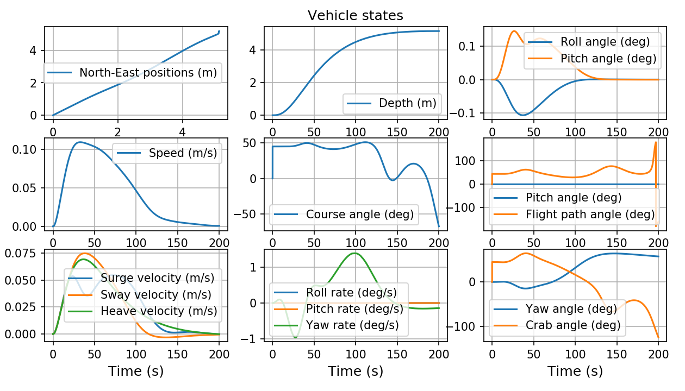
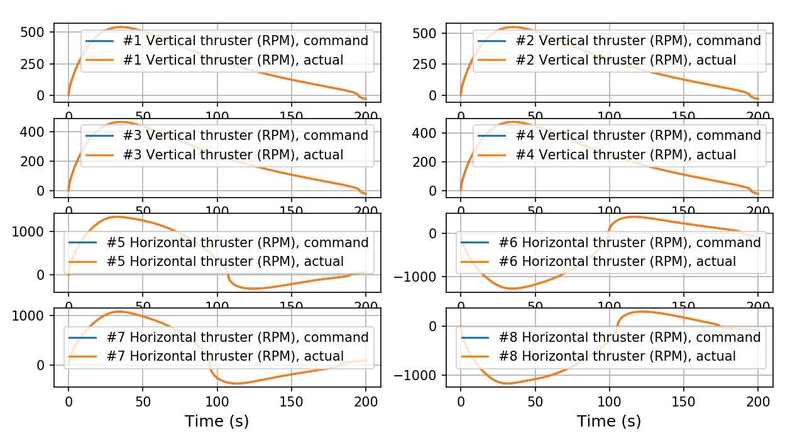
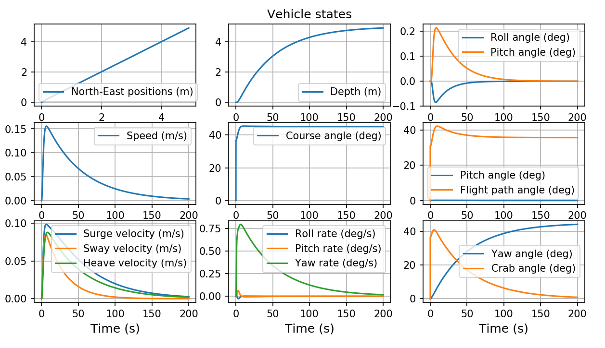
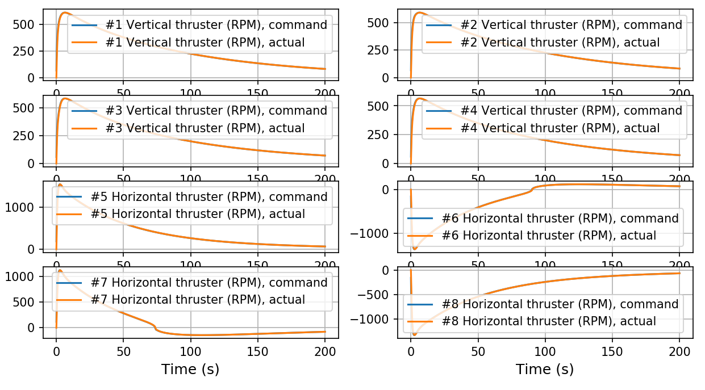

# Python Vehicle Simulator

The Python Vehicle Simulator is a supplement to the Matlab MSS (Marine Systems Simulator) toolbox. It includes models for autonomous underwater vehicles (AUVs), unmanned surface vehicles (USVs), and ships. The vehicle models are based on the MSS vessel models located in /MSS/VESSELS/ catalogue. Each vehicle is modeled as an object in Python and the vehicle class has methods for guidance, navigation and control. The main program:

    main.py
    
is used to define multiple vehicle objects for real-time simulation. The python modules are located under the catalogues: 

    /vehicles/               Vehicle classes/methods:
        swift.py                  - Autonomous underwater vehicle, controlled by 8 thrusters
        DSRV.py                 - Deep submergence rescue vehicle (DSRV) controlled by a stern plane, L = 5.0 m
        frigate.py              - Frigate, rudder-controlled ship described by a nonlinear Nomoto model, L = 100.0 m
        otter.py                - Otter unmanned surface vehicle (USV) controlled by two propellers, L = 2.0 m
        ROVzefakkel.py          - ROV Zefakkel, rudder-controlled ship described by a nonlinear Nomoto model, L = 54.0 m
        semisub.py              - Semisubmersible controlled by tunnel thrusters and main propellers, L = 84.5 m
        shipClarke83.py         - Ship, linear maneuvering model specified by L, B and T using the Clarke (1983) formulas
        supply.py               - Offshore supply vessel controlled by tunnel thrusters and main propellers, L = 76.2 m
        tanker.py               - Tanker, rudder-controlled ship model including shallow water effects, L = 304.8 m
    /functions/              Functions used by the main program:
        control.py              - feedback control systems
        gnc.py                  - generic GNC functions
        guidance.py             - guidance functions        
        mainLoop.py             - main simulation loop
        plotTimeSeries.py       - plotting functions
        
In order to run the main program main.py the following modules must be installed:

    numpy           https://numpy.org/install/
    matplotlib      https://matplotlib.org/stable/users/installing.html
    scipy              https://scipy.org/install/

For more information about mathematical modeling of marine craft and methods for guidance, navigation and control, please consult:

T. I. Fossen (2021). Handbook of Marine Craft Hydrodynamics and Motion Control. 2nd. Edition, Wiley. 
URL: www.fossen.biz/wiley

--------
Results for swift AUV control
--------

The reference waypoint is (5m, 5m, 5m) with heading angle (45 degree)

### Nonlinear MIMO PID using pole placement

### Linear Quadratic regulator

