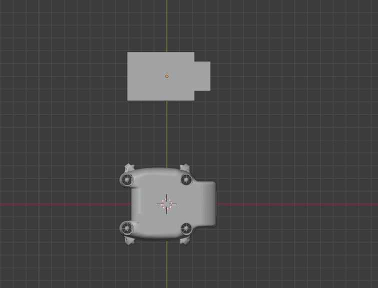
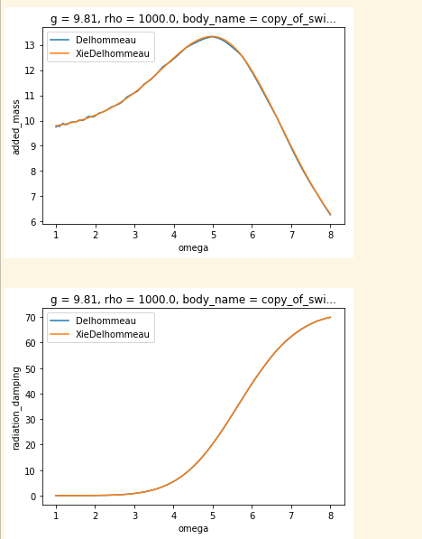

--------
Overview
------

Python script for calculating the hydrodynamic added mass matrix for underwater vehicles

--------
Table of contents
------

* [Dependencies](#Dependencies )
* [Usage](#Usage)

--------
Dependencies
------

* [Capytaine](https://github.com/mancellin/capytaine)

* scipy 1.4.1

--------
Usage
------

### Vehicle file preparation

Before running the script on your vehicle model make sure to satisfy the following requirements

* The vehicle model should be in stl format and it's size should be few Kilobytes.
* The vehicle model should be centered at the center of gravity [for this purpose use blender/solidworks software to set the origin].
* The vehicle model should has a very simple geometry.

The following figure shows the original model of our swift underwater vehicle and the simplified model for the added mass calculation

### Running

Change the body name from 'swift_simplified.stl' to your model and change the degree of freedom from 'Surge' to any other translation or rotation degree of freedom and then run the script. The following figure shows a sample result for added mass calculation on swift model in the surge direction.

### Note

As seen from the previous figure the added mass result is a function of the radiation frequency this because the software for the calculations is based on the seakeeping theory, for our purpose we take the peak of the graph as the final added mass coefficient value in the respective degree of freedom.
