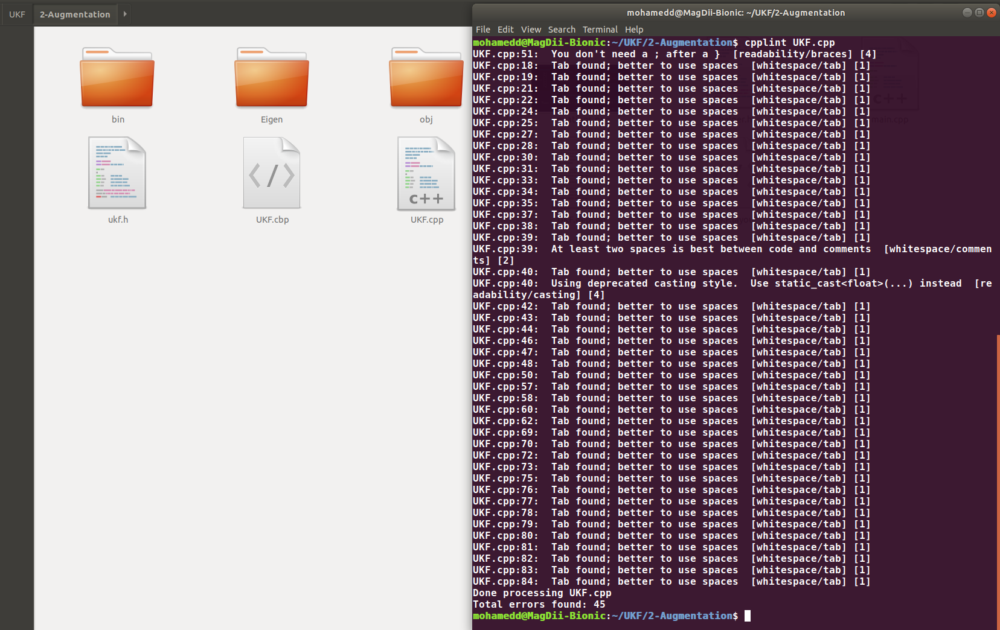

# C++ source code beautifier

## Description

The src_beautifier tool is a collection of shell scripts for getting your c++ packages almost ready for passing colcon test.
It does so by installing all the required tools, then reformatting all .cpp and .hpp files inside  ~/vortex_ws.


**Author: vortex-co<br />
Affiliation: [VorteX-Co](https://vortex-co.com/home)<br />
Maintainer: vortex-co, info@vortex-co.com**

 
## Table of content
* [Ament Cmake lints](#Ament-Cmake-lints)
* [What does this tool solves](#Specification-of-this-tool)
* [Usage](#Usage)
* [Demo](#Demo)

## Ament-Cmake-lints

When running ' $ colcon test ' command, a call for linters is performed onto your packages inside the workspace, for c++ packages the following linters is used:

* copyright   ~> a copyright linter which checks that copyright statements and license headers are present and correct
* cppcheck    ~> a C++ checker which can also find some logic tests
* cpplint     ~> a C++ style checker (e.g. comment style)
* xmllint     ~> an xml linter
* uncrustify  ~> a C++ style checker
* lint_camke  ~> a cmake linter


## Specification-of-this-tool

This tool automatically reformates all your c++ code inside ~/vortex_ws ros2 workspace to pass cpplint and uncrustify linters.
This means you have to add the copyright statement and license header to your code manually and also manually formating your package.xml and cmake files.
* For passing cpplint test we use clang-format tool.
* For passing uncrustify test we use uncrustify tool with a configuration file corresponds to ament_cmake_style.

### Important Note: There are some cpplint errors that cannot be solved by clang-format tool , some of these are:
* Using deprecated casting style. ~~~> Don't use C-style for casting.
* Wrong order of the included headers (The following order is the correct 1-corresponded header file 2- C headers 3- c++ headers)
* Missed 'extern' keyword in front of a single-paramter class constructor.
* Missed copyright message/header in the source code.
* Using STL features (vector,Matrix,queue) without including the respective C++ header.
* Using C data types like 'long x' ~> instead use 'uint64_t x'.
* Missed #ifndef header guard inside a C++ header file (.hpp). 
* No space between // and comment  ~> sperate them by at least 1 space.
* The else condition not on the same line as the preceding }  ~~~> Put the else condition on the same line of the closing } of the preceding conditon.


## Usage 

By default this tools automatically reformates all the .cpp and .hpp files inside ~/vortex_ws if this dir is available.
If you would like to format a new c++ file in an arbitrary directory you should execute the following commands:

```
$ clang-format -style=Google -i *.cpp
$ clang-format -style=Google -i *.hpp
```
```
$ uncrustify -c ~/ament_code_style.cfg --replace  *.cpp
$ uncrustify -c ~/ament_code_style.cfg --replace  *.hpp
```
## Demo

A simple demo is performed by installing cpplint test individually and running it on a single c++ file called UKF.cpp for example, then reformatting the code using clang-format and finally we running cpplint test again on UKF.cpp. We obserave that the number of cpplint errors is almost vanished.

1- Install the cpplint test

```
$ pip install cpplint
```

2- Run cpplint test on UKF.cpp file and observe the number of errors.

```
$ cpplint UKF.cpp
```

* 


3- Reformate the UKF.cpp file using clang-format

```
$ clang-format -style=Google -i UKF.cpp 
```

* 


4- Run cpplint again on UKF.cpp and observe the number of errors

```
$ cpplint UKF.cpp 
```
* 


